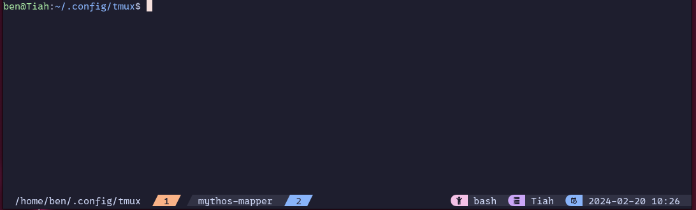

# TMux
Personal tmux config.

## Theming
This config will update tmux to look like this:


## Install
Clone into: `$HOME/config`
```bash
git clone git@github.com:bcvery1/tmux ~/.config/tmux
```

Grab the patched font from [here](https://github.com/ryanoasis/nerd-fonts/releases/download/v3.1.1/0xProto.zip)
to avoid status bar not rendering correctly. Ensure the terminal has the font set to the mono variant
of this font.

Launch tmux from the terminal and install plugins with `Prefix + I` *(the default previx is Ctrl+b)*

## Plugins
This config installs these plugins

### TPM
Package manager.

### Tmux Sensible
Adds sensible defaults for shortcuts.

### Tmux Sidebar
Use Prefix + backspace to toggle a tree-like file browser

### Tmux URL View
URL opener; use Prefix + `u` to open a URL opener. This will auto load any URLs in the current
buffer.

### Tmux Catppuccin
Theme to match NVim theme. Has the 'mocha' variant.
